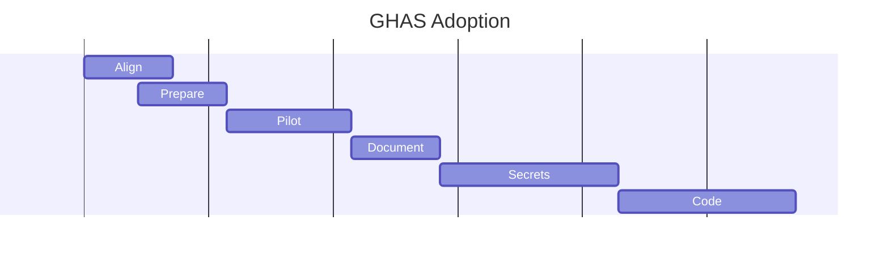
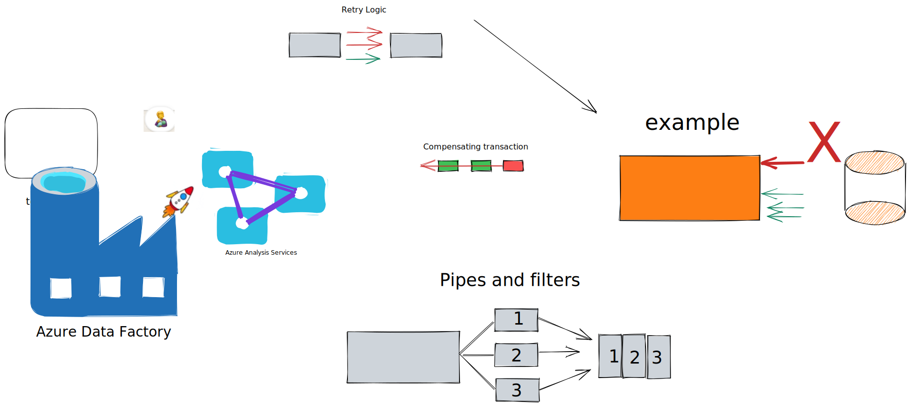

# drawings

## Mermaid

## Excalidraw
Example drawings using [Excalidraw Plugin for VSCode](https://marketplace.visualstudio.com/items?itemName=pomdtr.excalidraw-editor)

<!--
https://excalidraw.com/?target=_blank&referrer=vscode%3A%2F%2Fpomdtr.excalidraw-editor%2FimportLib&useHash=true&token=TmAqMLGxjVFUovBFD9b1a&theme=light&version=2&sort=default#json=XJoQ-CPJRIVqxOntzuA25,2jyZaZU71rNILBQPOOvTqA
-->

